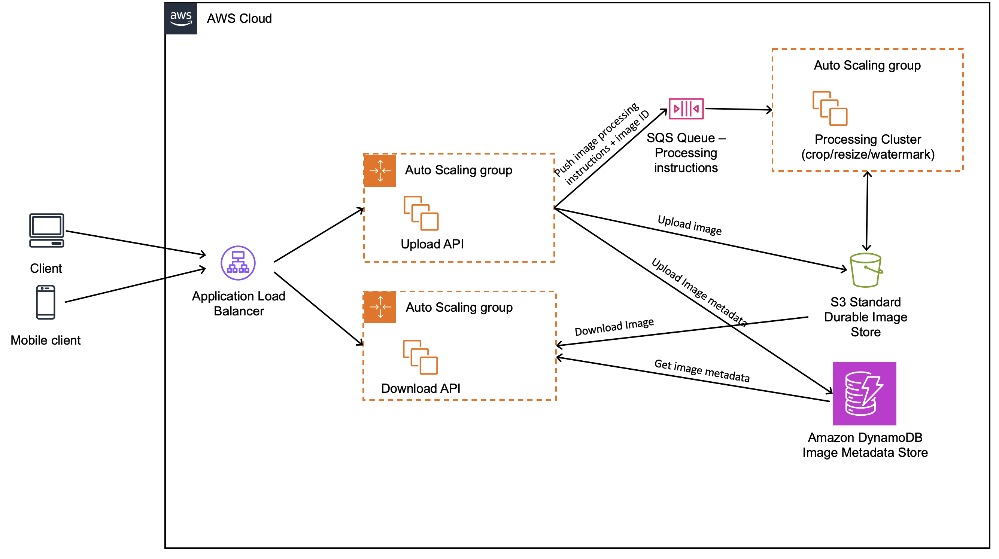
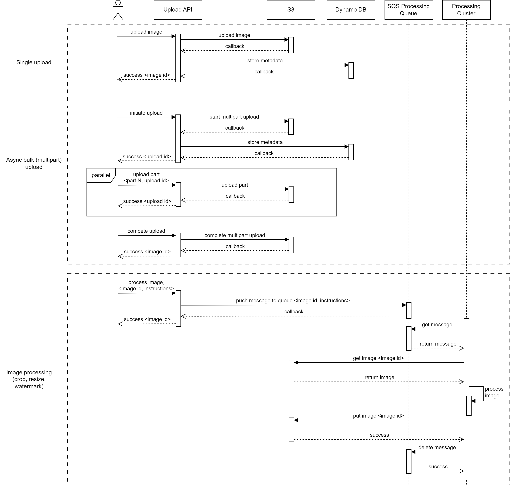

# Imaging Service

This document describes the system design of the image processing service.

### Requirements

1. Should be able to accept single/bulk image payloads 
2. Work both async and sync
3. Be able handle >100k images uploads and should be able to host >10M images / day
4. Allow you to define image processing instructions (crop/resize/watermark) [nice to have]

### Design Considerations

- The service API has high workload and needs to be scalable and highly available.
- The service stores large amount of images. Thus, the storage needs to be scalable, durable and also cost-effective. 
- Image processing logic might have high computational workloads. It should not directly influence API servers. So, it's 
better to run it in a separate cluster.
- The proposed design should cover also image download, which is logical to have, even though it is not stated in the requirements.
- For simplicity, current design bypasses the questions of authentication, data encryption, monitoring and logging. 

### Service Hosting

In the task, there are no special requirements on hosting. Current design suggests using AWS cloud and its managed 
services.  
However, it is not a must and similar architecture can be developed using any other cloud provider or even on-prem under 
the assumption of having enough computational power, memory and proper orchestration system (e.g. Kubernetes).

### System Architecture

The component diagram above, shows the main system blocks.

- Application Load Balancer: based on the request url, forwards it to one of the server goups: either Upload API or
Download API. 
- Auto Scaling Groups: use target tracking scaling policies (e.g. CPU, Memory, Network) to scale API servers. 
- Upload API: this API allows to upload images. It provides API for different upload use cases, including single image 
upload and bulk async (multipart) upload. Additionally, it allows to submit image processing 
instructions (crop/resize/watermark).  
- Download API: this is a separate API, because it has very different type of workloads than Upload API. So, Download 
API should be hosted in own auto-scaling group. The paratemers (e.g. instance types) of Upload API and Download API 
servers might also be different. They should be chosen based on performance testing. 
- Storage: the service stores images on S3. It's durable, scalable and cost-efficient.
- [Optional] DynamoDB: it is used to store image metadata. It might be needed if the service should cover 
special use cases such as image search, parametrization, etc. In the current use case, DynamoDB is more preferable than 
RDBMS because of the following factors: better scalability, no need for transactions, no hard defined schema 
(images might have different parameters), eventual consistency is enough, cost efficiency.
- Image processing SQS Queue: API servers push image processing instructions along with image ID into the SQS queue. It 
allows to balance the workload to the processing cluster, avoid back pressure and make image processing async. 
- Image processing cluster: it has a target tracking scaling group that scales based on CPU. Processing servers pick 
messages from the SQS queue, download image from S3, process it based on instructions and upload back to S3. 

### Requests flow

The diagram below outlines the sequence of requests in 3 main use cases: single upload, async bulk upload and image 
processing.

### Additional Notes

- The payload of the single upload should be limited (e.g. 100 MB). For larger payloads, user should use bulk upload.
- In case of bulk upload, the size of each part should be limited. Bulk upload uses S3 multipart upload logic, so it 
should follow the limitations of S3. 
- S3 has additional options to decrease costs, such as different storage classes and life cycle policies. 
- To decrease costs of the Processing Cluster, it is possible to use Spot Instances.
- To decrease costs of the API servers, it is possible to use reserved instances for the percentage of servers that are 
always in use.